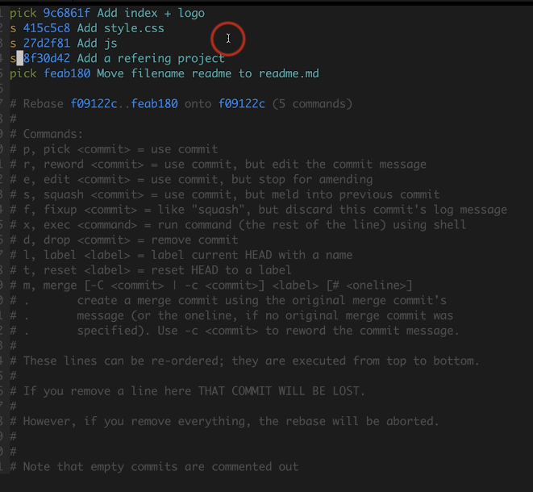

# git 操作

## 初始配置

1. 配置用户信息

git config --global user.name 'wmx'

git config --global user.email 'wangmingxingjava@126.com'

2. git的作用域

   git config --local    只针对某个仓库

   git config --global    针对所有仓库

   git config --system    对系统所有登录用户 

   显示config配置

   git config --list --local

   git config --list --global

   get config --list --system
   
## 原理

#### git里主要有三种数据类型 commit  tree  blob 

<strong style="color:red;">一个commit 里有tree对象tree对象更像是一个文件夹, 文件夹里包括其它文件夹和文件(blob)</strong>

#### 分离头指针

用git checkout<strong style="color:blue;">非最新的commit记录</strong>时,比如checkout 中间的某次记录,那么<strong style="color:blue;">HEAD会指向这个commit而没有指向分支</strong>.这时就会出现分离头指针的情况 .

那么会有如下提示

提示,我们工作在一个没有分支的情况下,建议用<strong style="color:blue;">git checkout -b <new-branch-name> </strong>  检出,并生成一个新的分支

此时,如果我们修改了某个文件,用命令git log看一下.会有如下提示

提交 commit

如果此时checkout出去了.那么改变会被丢弃,但是会有提示

## 使用操作

#### 给文件重命名/删除

git mv readme readme.md

git rm readme.md

#### 看版本历史

git log -n4   查看4次历史 

git log --oneline 简要看历史 

   

#### 分支操作

git branch -av    -a当前和远端 -v带有详细信息

git branch --graph 带有图形的

git branch -n4   最近的4个分支 

git branch -d
git branch -D 强制删
git branch -v 看本地有多少分支
git branch -a 本地和远端的分支信息

git branch    <branchName>  branchHashCode    创建新分支

git log 看当前分支的详细信息
git log --all 全部分支 
git log --oneline 简要的提交信息
git log -n4 最近4次
git log --graph 图形化的演进历史
git里有3种对象  commit  tree blob 是包含关系。

#### 修改最后一次提交的message

<strong style="color:blue;">git commit --amend</strong>

#### 修改老旧commit的message

git rebase -i  <commitId>    <strong style="color:blue;">-i是基于交互式的操作  commitId是提交的版本号</strong>，是一个父类，它的子类在它的基础上进行修改。

 点完后会有这样的交互式弹窗

然后wq! 保存，退出。它会弹出另一个交互页面

就可以修改提交的commit信息了。

#### 把连续多个commit整理成一个（变基）

<strong style="color:red;">在变基的时候，一个前提是只提交过本地仓库，没有提交过远程仓库的。不然会出错</strong>

将这4个commit合并成一个，base选择的是下边f09122cf的id

<strong style="color:blue;">git rebase -i  f09122cf</strong>

<strong style="color:blue;">s,squash 用这个提交，但是合并到以前的提交记录里。</strong>保存

弹出交互窗，可以填一些其它的注释，在鼠标的位置。同时保留了以前的message

#### 怎样把间隔的几个 commit整理成1个

把这两个commit合并,在这里没有比 f09122cf21更前的commit了。所以把他做基

<strong style="color:blue;">git rebase -i f09122cf21</strong>

调成这种顺序 ，先把自己的id   f09122cf21 pick出来，再对5cc5aa5 进行合并，34e735d 不用动。保存

这里弹出提示，这是因为pick f09122c导致的。略过就可以。

<strong style="color:blue;">git status</strong>

<strong style="color:blue;">git rebase --continue</strong>

保存后就成功了。

注意，执行完以后，会生成两个孤立的记录。这是因为选的基底不是原来的

#### git checkout 如何让工作区的文件恢复为和暂存区一样

git checkout --<file>  

<strong style="color:blue;">操作暂存区,用reset,操作工作区用checkout</strong>

#### git reset 消除最近的几次提交

<strong style="color:red;">git reset --hard  <commitId>  </strong> <strong style="color:blue;">头指针不在指向最高版本,而是指向你指定的版本.同时工作区和暂存区内容重置和HEAD一样</strong>

#### git reset 如何让暂存区恢复成和HEAD的一样

git reset HEAD  <file>      file可以是空,代表可以对单独文件恢复.也可以写多个,用空格分割

#### git stash开发中临时加塞了紧急任务怎么处理

把工作区修改的东西缓存起来

git stash 

git stash list

git stash apply  应用缓存   不会删除

git stash pop    应用缓存   删除缓存

当你修改完成后,再pop或能会出现问题,因为你已经提交了某个文件,基底已经变化. 此时你要reset到HEAD指向的commit,然后再pop

#### .ignore 如何指定不需要Git管理的文件

写.gitignore文件,注意,文件的写法   

1. readme    这种写法是readme这个文件和文件夹下面的都忽略
2. readme/   这种写法是只这个文件夹下面的忽略, 但是这个文件不能忽略

#### git remot 添加远端仓库 

<strong style="color:blue;">git remote add <remoteName>  gitAddr </strong>

#### 怎么快速淘到感兴趣的开源项目

key    in:readme    在readme里搜关键词

key    stars:>1000

key    language:java

key    filename:gitlab-ci.yml    带有文件名

